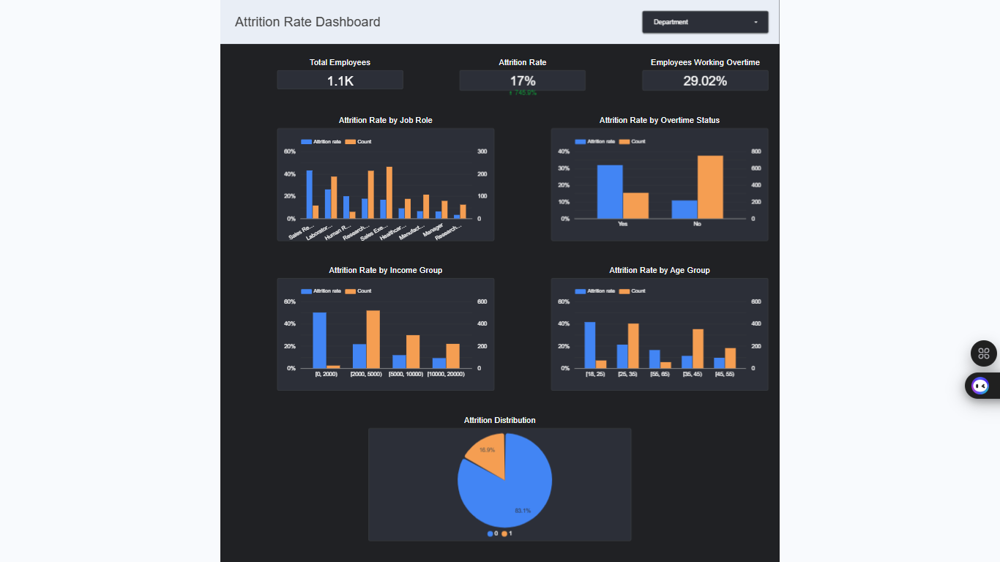

# Proyek Akhir: Menyelesaikan Permasalahan Perusahaan Edutech

## Business Understanding

Perusahaan Jaya Jaya Maju adalah perusahaan edutech yang sedang menghadapi tantangan dalam mempertahankan karyawan berkualitas. Tingkat attrition (pengunduran diri) karyawan yang tinggi dapat mengganggu operasional dan pertumbuhan perusahaan. Oleh karena itu, perusahaan perlu menganalisis faktor-faktor yang mempengaruhi attrition karyawan untuk mengembangkan strategi retensi yang efektif.

### Permasalahan Bisnis

Beberapa permasalahan bisnis yang akan diselesaikan dalam proyek ini adalah:

1. Tingginya tingkat attrition karyawan yang berdampak pada produktivitas dan biaya rekrutmen
2. Kurangnya pemahaman tentang faktor-faktor yang mempengaruhi keputusan karyawan untuk mengundurkan diri
3. Kesulitan dalam mengidentifikasi karyawan yang berisiko tinggi untuk mengundurkan diri
4. Tidak adanya strategi retensi karyawan yang efektif dan berbasis data

### Cakupan Proyek

Cakupan proyek yang akan dikerjakan meliputi:

1. Analisis data karyawan untuk mengidentifikasi pola dan faktor yang mempengaruhi attrition
2. Pembuatan model prediktif untuk mengidentifikasi karyawan yang berisiko tinggi mengundurkan diri
3. Pengembangan dashboard interaktif untuk memvisualisasikan data attrition dan hasil prediksi
4. Penyusunan rekomendasi strategi retensi karyawan berdasarkan hasil analisis

### Persiapan

Sumber data: Data karyawan perusahaan melalui link ini [Jaya Jaya Maju Dataset](https://github.com/dicodingacademy/dicoding_dataset/tree/main/employee), yang mencakup informasi demografis, pekerjaan, dan status attrition (employee_data.csv dan employee_data_clean.csv)

Setup environment:

Windows
```bash
python -m venv venv
```

```bash
venv\Scripts\activate
```

```bash
pip install -r requirements.txt
```

Anaconda
```bash
conda create --name submission python=3.12
conda activate submission
conda install --file requirements.txt
```

## Business Dashboard

Dashboard bisnis telah dibuat menggunakan Streamlit untuk memvisualisasikan data attrition karyawan dan hasil prediksi model machine learning. Dashboard ini memungkinkan pengguna untuk:

1. Melihat metrik utama seperti jumlah karyawan, tingkat attrition, dan persentase karyawan yang bekerja lembur
2. Menganalisis faktor-faktor yang mempengaruhi attrition seperti peran pekerjaan, status lembur, kelompok pendapatan, dan departemen
3. Melihat prediksi risiko attrition untuk setiap karyawan berdasarkan model machine learning
4. Memfilter data berdasarkan departemen dan peran pekerjaan untuk analisis yang lebih mendalam

Dashboard dapat diakses dengan menjalankan file `attrition_dashboard.py` menggunakan Streamlit:

```bash
streamlit run attrition_dashboard.py
```

Selain streamlit dashboard, saya telah membuat dashboard Looker Studio yang dapat diakses di link berikut: [Attrition Dashboard](https://lookerstudio.google.com/reporting/1acf7dee-e6a6-447a-a2fa-96ede9a00e6c)




## Conclusion

Berdasarkan analisis data dan model prediktif yang telah dikembangkan, dapat disimpulkan bahwa:

1. Faktor-faktor utama yang mempengaruhi attrition karyawan di perusahaan Jaya Jaya Maju adalah status lembur, tingkat pendapatan, peran pekerjaan, dan jarak dari rumah ke kantor
2. Karyawan yang bekerja lembur memiliki tingkat attrition yang lebih tinggi dibandingkan dengan karyawan yang tidak bekerja lembur
3. Karyawan dengan pendapatan rendah cenderung memiliki tingkat attrition yang lebih tinggi
4. Beberapa peran pekerjaan seperti Sales Representative dan Laboratory Technician memiliki tingkat attrition yang lebih tinggi dibandingkan peran lainnya
5. Model machine learning yang dikembangkan dapat memprediksi karyawan yang berisiko tinggi untuk mengundurkan diri dengan akurasi yang baik

### Rekomendasi Action Items

Berikut beberapa rekomendasi action items yang harus dilakukan perusahaan guna menyelesaikan permasalahan attrition karyawan:

- Mengevaluasi dan memperbaiki kebijakan lembur untuk mengurangi beban kerja berlebih pada karyawan
- Mengembangkan program pengembangan karir yang jelas untuk posisi dengan tingkat attrition tinggi seperti Sales Representative dan Laboratory Technician
- Meninjau struktur kompensasi untuk memastikan karyawan dengan pendapatan rendah mendapatkan kompensasi yang kompetitif
- Mengimplementasikan program work-from-home atau flexible working hours untuk karyawan yang tinggal jauh dari kantor
- Melakukan survei kepuasan karyawan secara berkala untuk mengidentifikasi masalah potensial sebelum menyebabkan attrition
- Menggunakan dashboard dan model prediktif untuk mengidentifikasi karyawan berisiko tinggi dan melakukan intervensi proaktif

